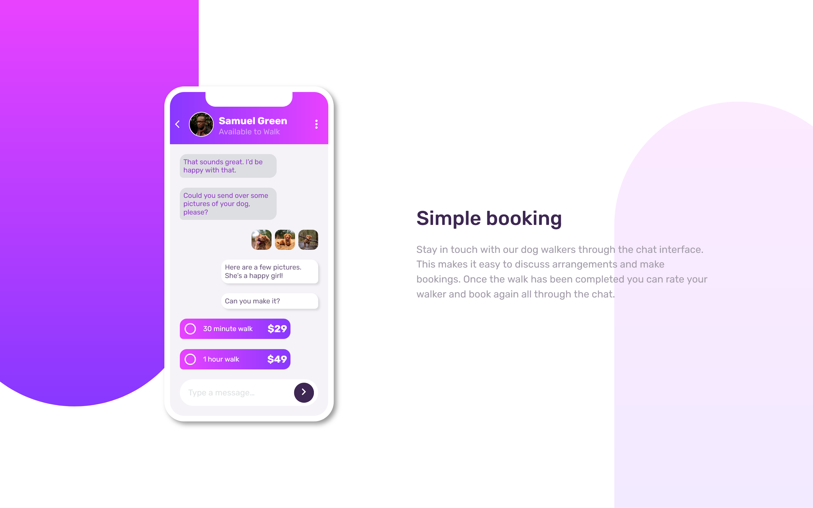
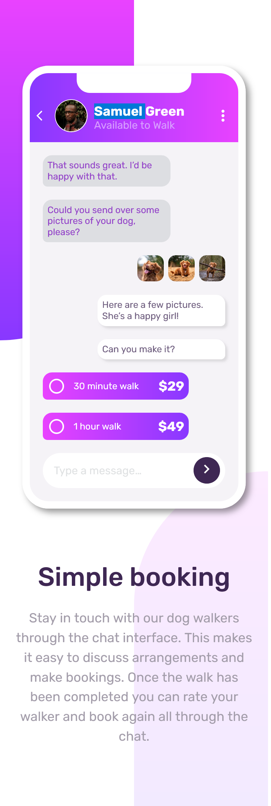

# Frontend Mentor - Chat app CSS illustration solution

This is a solution to the [Chat app CSS illustration challenge on Frontend Mentor](https://www.frontendmentor.io/challenges/chat-app-css-illustration-O5auMkFqY). Frontend Mentor challenges help you improve your coding skills by building realistic projects.

## Table of contents

- [Overview](#overview)
  - [The challenge](#the-challenge)
  - [Screenshot](#screenshot)
  - [Links](#links)
- [My process](#my-process)
  - [Built with](#built-with)
- [Author](#author)

## Overview

### The challenge

Users should be able to:

- View the optimal layout for the component depending on their device's screen size
- **Bonus**: See the chat interface animate on the initial load

### Screenshot

### Links

- Solution URL: [https://github.com/MIBENIN/CHAT-APP-UI-ILLUSTRATION](https://github.com/MIBENIN/CHAT-APP-UI-ILLUSTRATION)
- Live Site URL: [https://mibenin.github.io/CHAT-APP-UI-ILLUSTRATION/](https://mibenin.github.io/CHAT-APP-UI-ILLUSTRATION/)

## My process

### Built with

- HTML5
- CSS custom properties
- Flexbox
- Mobile-first workflow
- [Google Icons](https://fonts.google.com/icons)
- [Google Fonts](https://fonts.google.com/)

## Author

- Frontend Mentor - [@MIBENIN](https://www.frontendmentor.io/profile/MIBENIN)
